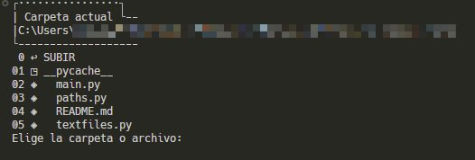
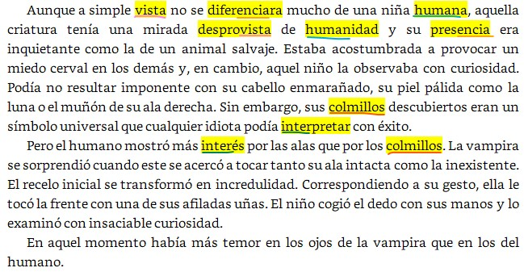

# Marking text repetitions tool

Parses a text document and creates a copy in which repetitions and nearby similar words are highlighted.

Input formats:  
- txt
- md
- docx

Output formats:  
- docx
- md

## Requirements
Tested with:
- Python==3.10.2
- python-docx==0.8.11

`pip install python-docx`

## Usage
Close any document to parse first.  
Run `main.py`.  
Browse the directories and files with numeric inputs  

Choose a text file.  
Two new files will be created:  
- `filename-py.docx`
- `filename-py.md`

## How it works
First, it extract all the paragraphs from the source. Each word is compared to others (-30 before / +30 after, approx., but configurable).

For comparison purposes, each word is lowercase. By default, it takes 5 minimun consecutive letters, so it matches "iendo" in:

> «Dicen que encontraron al mago ==durmiendo== en la letrina de una casa de juegos y que con la resaca que lleva tendrán suerte si no termina ==maldiciendo== a la niña con un brazo muerto».  

But it will also match weird cases like "rilla" in:

> «En la oscuridad, su tez y sus dientes ligeramente puntiagudos ==brillaban== a la luz de una luna ==amarilla==». 

## Keep in mind
Italic, bold and other text format will be lost. The copy files are only for reference when I make a style correction of the text.

Highlight format in markdown (==like this==) are not supported for all the editors.

Python-docx highlight format is sort of weak. This means they can dissapear once the file is closed for the first time. I don't know why. The words remain with a character style named "highlight", so they can be formatted to bold or other style easily.

Interface in Spanish.

## Known issues
Besides some annoying behaviours previously commented, the paragraph extraction process leads to some losses of information (some line breaks, mainly).
---

# Herramienta de marcado de repeticiones en texto 

Analiza un documento de texto y crea una copia en la que aparecen resaltadas repeticiones y palabras similares cercanas.  

Formatos de entrada:  
- txt
- md
- docx

Formatos de salida:  
- docx
- md

## Requisitos
Comprobado con:
- Python==3.10.2
- python-docx==0.8.11

`pip install python-docx`

## Uso
Cierra antes cualquier documento que vaya a analizarse.  
Corre `main.py`.  
Navega por los directorios y archivos introduciendo su valor numérico  

Escoge un archivo de texto.  
Se crearán dos archivos nuevos en la carpeta del archivo escogido:
- `nombreArchivo-py.docx`
- `nombreArchivo-py.md`

## Cómo funciona
Se extrae todo el texto del documento. Cada palabra se compara con las anteriores y posteriores más cercanas (aproximadamente 30 hacia atrás y 30 hacia adelante, pero es configurable). 

Para la comparación, se quitan los caracteres que no sean alfanuméricos y cada palabra se pasa a minúsculas sin tildes. El método de comparación revisa un número mínimo de coincidencias entre sus letras, en el mismo orden, de manera que con 5 coincidencias señalará:

> «Dicen que encontraron al mago ==durmiendo== en la letrina de una casa de juegos y que con la resaca que lleva tendrán suerte si no termina ==maldiciendo== a la niña con un brazo muerto».  

En este caso encuentra 5 coincidencias (letras): "iendo". Pero también encontrará parejas más peculiares como:

> «En la oscuridad, su tez y sus dientes ligeramente puntiagudos ==brillaban== a la luz de una luna ==amarilla==». 

Coincidencias: "rilla".

## Ten en cuenta
La cursiva, la negrita y otros formatos de texto se perderán en los archivos resultantes. Estos los uso solo como referencia cuando hago una corrección de estilo del texto y no debe corregirse sobre ellos.

El formato de resaltado en Markdown (==como este==) no es compatible con todos los editores.

El formato resaltado de Python-docx es algo débil. Esto significa que puede desaparecer al abrir el archivo por segunda vez o en cualquier momento tras su primera apertura. No sé por qué, tal vez es cuestión de versiones. De todas formas, las palabras mantienen un estilo de carácter llamado "highlight", por lo que se puede editar fácilmente para dar fomato negrita u otro estilo a todas a la vez.

## Errores conocidos
Aparte de algunos molestos comportamientos ya mencionados, el proceso de extracción de párrafos del texto desde un docx conlleva cierta pérdida de información. En especial, algunos saltos de párrafo. El documento resultante suele tener errores y discrepancias en este sentido, en algunos casos sin los correspondientes saltos. 
